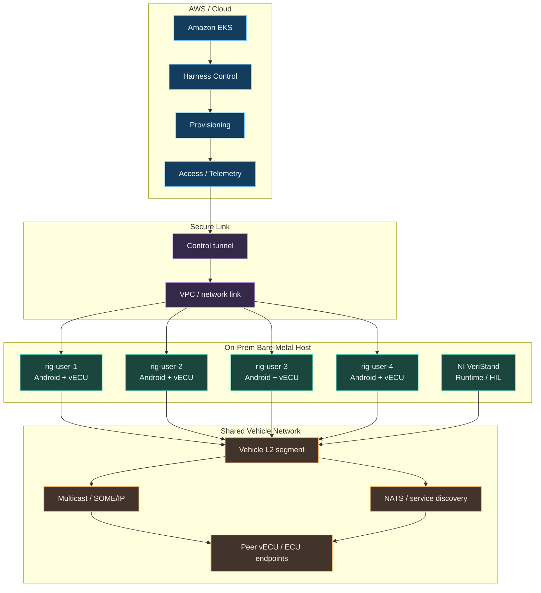

```mermaid
flowchart TB
    subgraph CLOUD[AWS / Cloud]
        C1[Amazon EKS]
        C2[Harness Control]
        C3[Provisioning]
        C4[Access / Telemetry]
    end

    subgraph EDGE[Secure Link]
        E1[Control tunnel]
        E2[VPC / network link]
    end

    subgraph HOST[On-Prem Bare-Metal Host]
        H1[rig-user-1\nAndroid + vECU]
        H2[rig-user-2\nAndroid + vECU]
        H3[rig-user-3\nAndroid + vECU]
        H4[rig-user-4\nAndroid + vECU]
        NIS[NI VeriStand\nRuntime / HIL]
    end

    subgraph NET[Shared Vehicle Network]
        N1[Vehicle L2 segment]
        N2[Multicast / SOME/IP]
        N3[NATS / service discovery]
        N4[Peer vECU / ECU endpoints]
    end

    C1 --> C2
    C2 --> C3
    C3 --> C4
    C4 --> E1
    E1 --> E2
    E2 --> H1
    E2 --> H2
    E2 --> H3
    E2 --> H4

    H1 --> N1
    H2 --> N1
    H3 --> N1
    H4 --> N1
    NIS --> N1

    N1 --> N2
    N1 --> N3
    N2 --> N4
    N3 --> N4

    classDef cloud fill:#143d5d,stroke:#7bd0ff,color:#edf9ff,stroke-width:1.5px;
    classDef edge fill:#352848,stroke:#d7a8ff,color:#f8f1ff,stroke-width:1.5px;
    classDef host fill:#1b463d,stroke:#6fe5c6,color:#ebfff8,stroke-width:1.5px;
    classDef net fill:#43342b,stroke:#ffbf7a,color:#fff5e7,stroke-width:1.5px;
    classDef ni fill:#2f4455,stroke:#8aaed8,color:#edf5ff,stroke-width:1.5px;

    class C1,C2,C3,C4 cloud;
    class E1,E2 edge;
    class H1,H2,H3,H4,NIS host;
    class N1,N2,N3,N4 net;
```
